<p align="center">
  
</p>

A real-time shared clipboard. Open the page on two machines, type or paste on
one, and it appears on the other within a few hundred milliseconds. Runs on
Cloudflare Workers with a Durable Object for the live sync.

- **One shared pane** — both machines edit the same text; last write wins.
- **Password-gated** — only clients with the shared password join the room.
- **Persistent** — the current text survives reconnects and server restarts.

## How it works

- The Worker serves a single HTML page and upgrades `/ws` to a WebSocket.
- A single Durable Object (`Room`) holds the current text and fans updates out
  to every connected client. A late joiner gets the latest text on connect.
- The password is checked in the Worker, before the WebSocket reaches the
  Durable Object. It's stored as a Cloudflare secret, never in the repo.

## Setup

```bash
npm install
```

Set the room password (stored as an encrypted secret, not in any file):

```bash
npx wrangler secret put ROOM_PASSWORD
```

For local development, create a `.dev.vars` file (git-ignored):

```
ROOM_PASSWORD=your-dev-password
```

## Run locally

```bash
npm run dev
```

Open the printed `localhost` URL in two browser windows, enter the password in
each, and type.

## Deploy

```bash
npm run deploy
```

### Custom domain (copy.jaba.ge)

After the first deploy, attach the domain either in the Cloudflare dashboard
(Workers & Pages → your Worker → Settings → Domains & Routes → Add custom
domain) or by uncommenting the `routes` block in `wrangler.toml` and
redeploying. The domain must be on the same Cloudflare account.

## Notes

- Text is capped at ~1 MB per update.
- This is a single shared room. To support multiple independent rooms, derive
  the Durable Object name from a room ID in the URL instead of the fixed
  `"main"` constant in `src/worker.js`.
